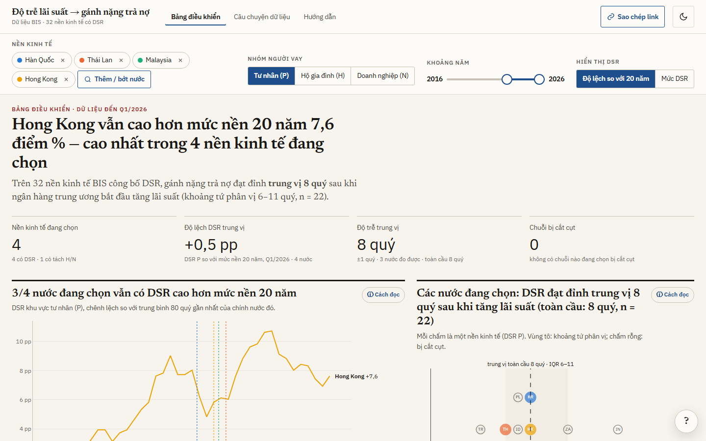
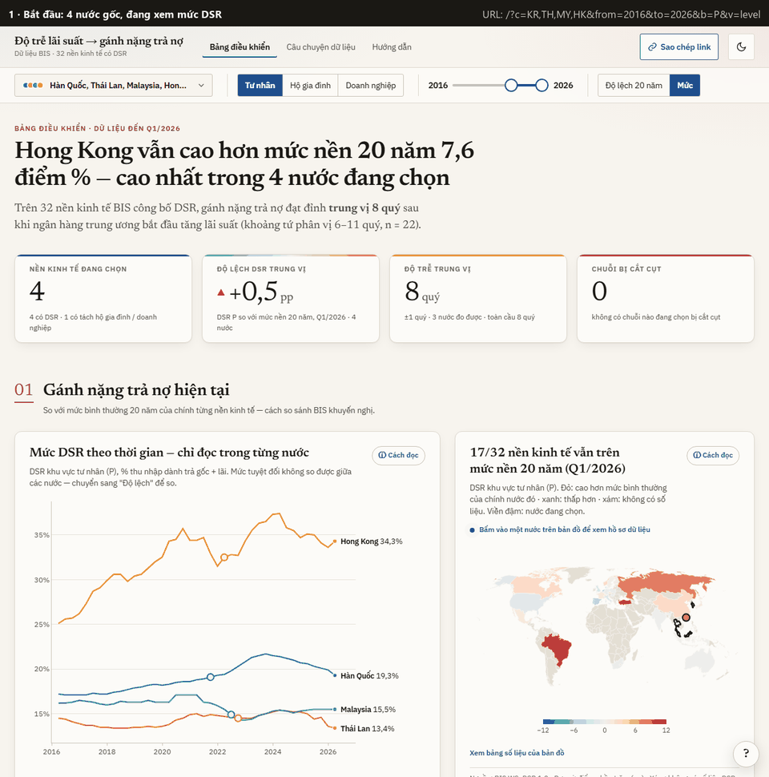
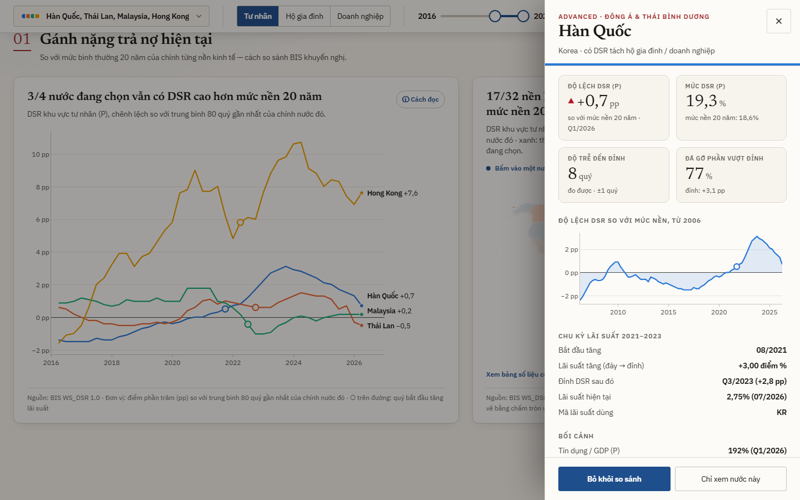
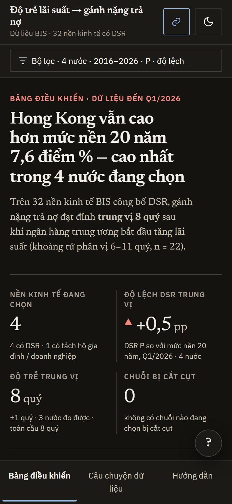
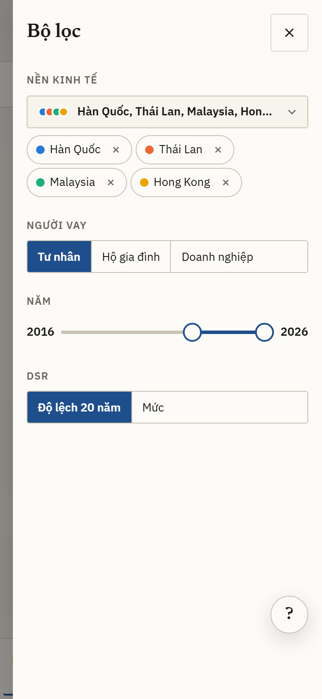
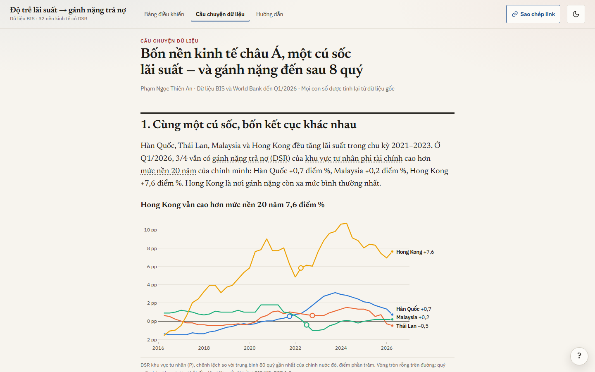

# How long does a rate hike take to bite?

### Policy rates and private-sector debt service across BIS economies

When a central bank starts raising rates, the private sector does not feel it at once: existing loans reprice gradually. I measure that delay with BIS data. For every economy that tightened in 2021–2023, a fixed rule finds the month of lift-off, and I count the quarters until the private non-financial sector's debt service ratio (DSR) peaked. Across the 22 economies where that peak can be measured, the median delay is **8 quarters** (interquartile range 6–11). Four Asian economies anchor the story. Korea and Hong Kong SAR sit at the median, Thailand slightly below it, and Malaysia's DSR never rose above its pre-hike level. Hong Kong is still **7.6 percentage points** above its own 20-year average in 2026-Q1.

**Live demo:** _not deployed yet_ · runs locally in one command ([How to run](#how-to-run))



---

**Contents** · [Research question](#research-question) · [Data](#data) · [Methodology](#methodology) · [Key findings](#key-findings) · [How to use the dashboard](#how-to-use-the-dashboard) · [Limitations](#limitations) · [How to run](#how-to-run) · [Project structure](#project-structure) · [Author](#author) · [Use of AI tools](#use-of-ai-tools)

## Research question

> After the 2021–2023 tightening cycle, how long did higher policy rates take to reach the private sector's debt service burden, and has that burden returned to normal?

I answer at two levels:

- **Global.** A lag distribution over every economy for which the BIS publishes a DSR.
- **Focus.** Korea, Thailand, Malaysia and Hong Kong SAR, the four economies the project started with, placed inside that distribution.

Every comparison is made against an economy's **own history**. The BIS warns that DSR levels are not comparable across countries: income definitions, loan maturities and lending structures differ too much.

## Data

Everything is downloaded by [`scripts/fetch_data.py`](scripts/fetch_data.py) and never edited by hand. Coverage below is from the run on 2026-10-06.

| Dataset | Source | Unit | Frequency | Coverage |
|---|---|---|---|---|
| Debt service ratio, borrowers H / N / P | BIS `WS_DSR 1.0` | % of income | Quarterly | 32 economies, 1999-Q1 → 2026-Q1 (Türkiye from 2002-Q1). Household/corporate split for 17. No gaps since 2020. |
| Credit to the non-financial sector, H / N / P | BIS `WS_TC 2.0` (all lenders, market value, break-adjusted) | % of GDP | Quarterly | 43 economies + euro area, back to 1947-Q4 at the earliest → 2026-Q1. No gaps since 2020. |
| Central bank policy rate | BIS `WS_CBPOL 1.0` | % per year | Monthly | 51 economies + euro area. 47 run to 2026-08, three end in 2026-06/07, Argentina in 2025-06. Singapore has none. |
| Bank NPL to gross loans | World Bank `FB.AST.NPER.ZS` | % of loans | Annual | 50 economies. Latest year 2025 for 36, 2024 for 10, earlier for 4 (Korea and Russia 2023, Japan 2022, Singapore 2019). |

That makes **52 economies plus the euro area**: every economy that appears in at least one of the three BIS datasets.

The same script writes three reference tables, all parsed from official sources rather than typed:

- [`countries.csv`](data/meta/countries.csv) gives, per economy, the names (English and Vietnamese) and World Bank region. It also gives the advanced/emerging group from the BIS *Convention for country groupings* (January 2026), which DSR borrower groups exist, the first and last period of each dataset, and the policy-rate code used.
- [`coverage.csv`](data/meta/coverage.csv) gives the percentage of missing observations by economy × series × period.
- [`euro_area_members.csv`](data/meta/euro_area_members.csv) lists euro area members and their adoption year, from the ECB.

**Which policy rate applies.** The 13 euro area members in the data switch to the ECB rate (BIS `XM`) in January of their adoption year and keep their national rate before it. Hong Kong keeps the HKMA base rate, flagged as a USD peg. Denmark is flagged as pegged to the euro. Singapore steers through the exchange rate and has no policy rate, so it is left empty rather than given a proxy.

**Missing values stay missing.** Nothing is interpolated, carried forward or replaced with a proxy, and every chart says which economies lack data.

## Methodology

All calculations live in one module, [`analysis/core.py`](analysis/core.py). The notebook and the dashboard builder both call it, so they cannot disagree.

**20-year benchmark.** For each DSR series, the benchmark is the mean of its last 80 quarters (2006-Q2 → 2026-Q1, all quarters present). The **gap** is the DSR minus that benchmark, in percentage points (pp).

**Lift-off, by rule.** On the monthly policy rate, within January 2021 – December 2023:

1. the **trough** is the first month the rate reaches its lowest level in the window;
2. **lift-off** is the first later month in the window with a higher rate;
3. the **hike** is the highest rate up to December 2024 minus the trough.

No month satisfies step 2 for China and Japan, so they have **no hiking cycle** and are left out of the lag analysis. One extra rule covers Croatia: a rate jump in the month a country adopts the euro is a switch to the ECB rate, not a hike.

**Lag.** I count the quarters from the quarter containing lift-off to the first quarter with the highest DSR after it. Lift-off is monthly and the DSR quarterly, so lags are reported in whole quarters (**±1 quarter**). Two flags keep the distribution honest:

- **Censored.** The peak is the last observation, so the true peak may still be ahead and the lag is a lower bound. These are drawn hollow and kept out of the headline median, and I check the result with a Kaplan–Meier median.
- **No rise.** The DSR never exceeds its pre-hike level, or only falls after lift-off. There is no peak to time.

The headline uses the **private non-financial sector (P)**, available for all 32 economies. Households (H) and corporations (N) are a split analysis for the 17 economies that publish them.

**Correlations** are reported with **n** and a **95% confidence interval** (Fisher z), and are descriptive only. For NPL I match annual NPL to the DSR's fourth quarter instead of interpolating NPL to quarters.

## Key findings

All figures come from the current run of [`notebooks/01_analysis.ipynb`](notebooks/01_analysis.ipynb).

### 1. The typical lag is about two years

| Borrowers | Measured | Median | IQR | Range | Censored | No rise | No cycle |
|---|---|---|---|---|---|---|---|
| **Private non-financial (P)** | **22** | **8 quarters** | **6–11** | 1–17 | 2 (Brazil ≥ 20, India ≥ 15) | 6 (DE, ES, FR, GB, MY, NL) | 2 (CN, JP) |
| Households (H) | 10 | 5.5 | 5–7.75 | 3–13 | 1 | 5 | 1 |
| Corporations (N) | 6 | 9.5 | 7.25–11.75 | 2–12 | 1 | 9 | 1 |

Counting the two censored series as lower bounds leaves the median at 8 quarters, and so does Kaplan–Meier. My starting hypothesis of 12–18 months (4–6 quarters) sits at the short end of what the data show.

### 2. The four focus economies are typical in timing, not in size

| Economy | Lift-off | Hike | DSR peak | Lag | DSR rise | Gap, 2026-Q1 |
|---|---|---|---|---|---|---|
| Hong Kong SAR | 03/2022, same month and size as the Fed | +5.25 pp | 2024-Q1 | 8 quarters | +5.9 pp | **+7.6 pp** |
| Korea | 08/2021 | +3.00 pp | 2023-Q3 | 8 quarters | +2.8 pp | +0.7 pp |
| Thailand | 08/2022 | +2.00 pp | 2024-Q1 | 6 quarters | +0.8 pp | −0.5 pp |
| Malaysia | 05/2022 | +1.25 pp | — | no rise | — | +0.2 pp |

In Korea, the only one of the four with the borrower split, corporations peaked after 8 quarters (+7.8 pp). Households peaked later, after 12 quarters (+0.6 pp).

### 3. Recovery is uneven

In 2026-Q1, **17 of 32** economies still have a DSR above their own 20-year mean. The widest gaps are Türkiye (+10.9 pp), Brazil (+10.6), Russia (+7.8) and Hong Kong (+7.6). Hong Kong has unwound only 29% of its peak excess, Korea 77%, and Thailand is back below its benchmark.

### 4. Bigger hikes, bigger burdens — but only because of a few extreme cycles

Across 24 economies, hike size and DSR rise correlate strongly (Pearson r = 0.91, 95% CI 0.79–0.96), but the rank correlation is only 0.47. Without the four cycles above 10 pp (Brazil, Hungary, Russia, Türkiye), **r falls to 0.09 (95% CI −0.37 to 0.51, n = 20)**. Hike size says essentially nothing about the lag (r = −0.03, 95% CI −0.44 to 0.40, n = 22).

### 5. Bad loans have not followed the DSR

For 30 of the 32 economies, the confidence interval for the correlation between annual changes in NPL and DSR includes zero. Norway is the exception (r = 0.59, 95% CI 0.14–0.84, n = 16), and Germany has too few years to tell (n = 3). Examples: Hong Kong r = −0.27 (95% CI −0.66 to 0.25, n = 17) and Korea r = −0.08 (95% CI −0.58 to 0.47, n = 14). With 3–20 annual observations per economy, the data cannot establish a link either way.

## How to use the dashboard

The site has three pages: **Bảng điều khiển** (dashboard), **Câu chuyện dữ liệu** (the story of the four focus economies, set against the global distribution) and **Hướng dẫn** (guide). The interface is in Vietnamese.



1. **Pick economies.** *Chọn nước* opens a searchable list grouped by region, with one-click groups: the 4 original economies, Asia, euro area, advanced, emerging. Each economy keeps its colour on every chart. Above six economies, line charts become small multiples.
2. **Pick the borrowers.** P, H or N. Options no selected economy publishes are hidden.
3. **Pick the years.** Drag the two handles or use the arrow keys. The end year also sets the quarter shown on the map and in the KPI cards.
4. **Deviation or level.** The default is the deviation from each economy's own 20-year mean. The level view warns that levels cannot be compared across countries.
5. **Open a country.** Click a country on the map, a dot on the lag or cross-country chart, or a line on the DSR chart. A profile opens with the gap, DSR level, lag, rate cycle, credit/GDP, NPL and a line since 2006, plus buttons to add the country to the comparison or view it alone.
6. **Share.** Filters live in the address, for example `?c=KR,TH,MY,HK&from=2016&to=2026&b=P`, and *Sao chép link* copies it.

Each chart title states its finding, computed from the data, with source and unit underneath. **ⓘ Cách đọc** explains what the chart shows, how to read it and what not to conclude from it. A five-step tour runs on the first visit, and the **?** button replays it. The page has light and dark themes. Cards and charts animate in as they appear, and all motion turns off when the device asks for reduced motion.



| Mobile, dark theme | Filters on mobile | Story page |
|---|---|---|
|  |  |  |

## Limitations

- **One peak per economy.** Each lag is the distance to a single peak on a quarterly series (±1 quarter). Other shocks in the same window, such as pandemic-era swings in income, can move that peak.
- **Censoring.** Brazil's and India's DSRs are still at their sample high. If their peaks come much later, the median would rise.
- **How the DSR is built.** The BIS assumes fixed remaining maturities and repayment profiles, which is why levels are not comparable across economies.
- **Borrower split.** Only 17 of 32 economies publish household and corporate DSRs. Thailand, Malaysia and Hong Kong do not.
- **Exchange-rate regimes.** Hong Kong's and Denmark's policy rates largely mirror another central bank, and Singapore has no policy rate in the data.
- **NPL data** are annual, system-wide and published with delays, so NPL–DSR correlations are descriptive.
- **No forecasts.** Everything stops at the latest observation: DSR and credit 2026-Q1, policy rates 2026-08, NPL 2025.

## How to run

Requires Python 3.10 or newer.

```bash
pip install -r requirements.txt
python product/serve.py        # opens http://localhost:8000
```

The repository already contains the data, so this is all you need to see the dashboard. To rebuild everything from the source APIs:

```bash
python scripts/fetch_data.py --refresh                                           # download raw data
jupyter nbconvert --to notebook --execute --inplace notebooks/01_analysis.ipynb  # run the analysis
python product/build_site.py                                                     # rebuild the dashboard data
pytest -q                                                                        # unit tests
```

The site is static and works offline. Plotly, the world map and the fonts ship with it (`product/vendor_assets.py` refreshes them). Open it through `serve.py`, not by double-clicking `index.html`, because browsers block data loading from `file://`. [`vercel.json`](vercel.json) is set up to publish `product/site` as a static site. GitHub Actions runs the tests, executes the notebook and checks that the dashboard data match `data/raw`.

## Project structure

```
BIS-dta-story/
├── scripts/fetch_data.py        # BIS, World Bank, ECB and BIS reference lists -> data/
├── data/
│   ├── raw/                     # files exactly as downloaded
│   ├── meta/                    # countries.csv, coverage.csv, euro_area_members.csv
│   └── processed/               # tables written by the notebook
├── analysis/core.py             # every calculation: benchmark, lift-off, lag, censoring, CIs
├── notebooks/01_analysis.ipynb  # analysis and data story (Vietnamese)
├── tests/test_core.py           # synthetic series with known answers
├── product/
│   ├── build_site.py            # analysis -> dashboard data
│   ├── serve.py                 # local server
│   ├── DESIGN.md                # design system
│   └── site/                    # the dashboard
├── docs/screenshots/            # screenshots and the usage GIF
├── DECLARATION_AI.md            # declaration of AI use (Vietnamese)
└── INTERVIEW_NOTES.md           # presentation notes (Vietnamese)
```

## Author

**Pham Ngoc Thien An** (Phạm Ngọc Thiên An)
Student ID K244141653 · Faculty of Finance and Banking, University of Economics and Law, VNU-HCM

## Use of AI tools

I used an AI coding assistant for parts of the code, the calculations and the drafting. What it did, what I decided and how I checked the results are set out in [DECLARATION_AI.md](DECLARATION_AI.md).
